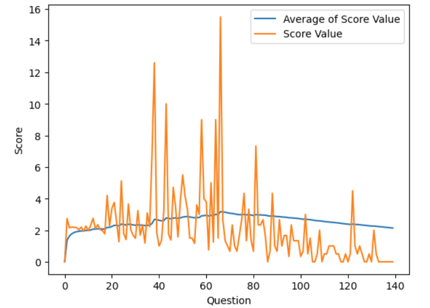
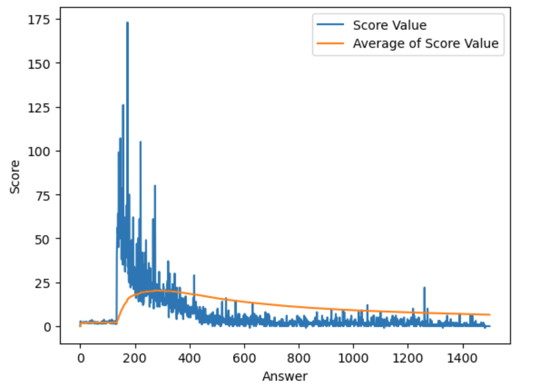
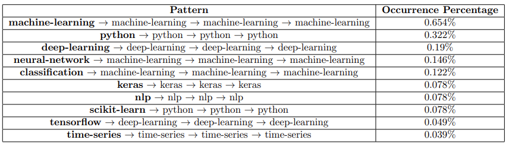

# Stack-Exchange-User-Growth-Analysis
Stack Exchange is an internet forum website that allows users to post and answer questions about a variety of topics. The website releases data every three months that documents users, posts, tags, flags, votes, and a variety of other metrics.

# Data Analysis & Insights
Stack Exchange relies on users of the platform for content through questions and answers. We
hypothesize that users improve as community members as they use the site for longer. Our investigation will test this hypothesis via a triangulation of four experiments. First, we evaluate
the quality of posts over time. Second, the improvement in response time as users post more is
measured. Third, exploration of whether there are any trends in the topics users post about, over
time, is performed. Finally, the connection between time on the site and the awards users receive
is evaluated.

## Post Quality Over Time

The figure above depicts that as a user asks more questions over a period of time, the scores of the
questions asked increase. This infers a positive trend until the 65th question asked, which supports
our hypothesis. We see a decrease in average score after the 65th question because there are less
than 3 users who have asked a total greater than 65 questions on the platform. Therefore, the
majority of the data supports our hypothesis.

The figure above depicts that as a user answers more questions over a period of time, the scores of
the answer posts increase. This infers a positive trend until the 350th answer post, which supports
our hypothesis. We see a decrease in average score after the 350th answer post because there are
less than 2 users who have posted an answer for a total greater than 350 questions on the platform.
There is also an unusual spike at the 150th answer mark. This unusual spike can be explained
to the fact that there are a great number of users who post random answers or comments. This
attributed noise negates the increase in average due to good scoring answers. But this noise stops
at about the 150th answer mark. This means that the users who do not have interest in the topic
tend to post at most 150 bad answers before stopping. This gives us a rough upper bound on the
noisy data. It can also be inferred that only active and well-performing users post more than 150
answers on the portal. Therefore, the majority of the useful data supports our hypothesis.

## User Topics Over Time

The data here provides a few keys insights, the first being that users who post questions about
popular topics tend to be relatively focused within that topic. Users with at least 4 posts, whose
first post contained the tags machine-learning, python, deep-learning, keras, nlp, and time-series
tended to stay within that topic. Exceptions are the neural-network and classification tags which
switch quickly to machine learning, likely due to both tags being used in combination with the
machine-learning tag. Classification and neural-networks are often used in introductory material
to machine learning, so that pattern being popular makes sense as well. Other exceptions include
the scikit-learn tag which switches to python, and tensorflow which switches to deep-learning.
What we found most interesting, was the scikit-learn → python path. The scikit-learn → python
path is likely due to people who are just getting into machine learning with little experience programming in python, as people learning more specialized topics tend to have gaps in their general
knowledge that they need to fill. The tensorflow → deep-learning path is a bit simpler and likely
explained by the fact that tensorflow is often used as a library to tackle deep-learning problems.
Overall, the data suggests that users who ask more specific questions to start, tend to have some
gaps in their general knowledge that they realize they need to fill, and users who ask more general
questions don’t tend to specialize that quickly. Further analysis could look at tag coexistence among
the popular tags, with the combination of that data, along with this path data being useful for
suggesting questions to certain users that they would likely be more interested in.

## Badges Earned Over Time

### Finidngs
A user with at least one gold badge, tends to have an average of
16 total badges, while a user with at least one silver badge tends to have a lower number, at an
average of 9.7 total badges. If a user only has a bronze badge, that user tends to have only 2 total
badges. This finding shows that as a user strives to achieve a more difficult badge, the user must
be able to teach new users how the portal works, as well as take part in activities that are positive
towards the community. Only then can a user gain enough easier to achieve badges and thus in due
time, earn a gold badge.
As mentioned in the report, it is evidently more time consuming to achieve gold and silver
badges. This is directly related to the fact that if a user puts in more time and effort to learn
particular skills, improve and build on their previous knowledge, and grow as a whole, in a particular
field of interest, only then is that user awarded a gold or a silver badge.
